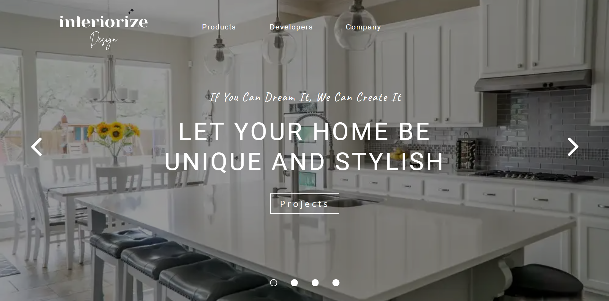
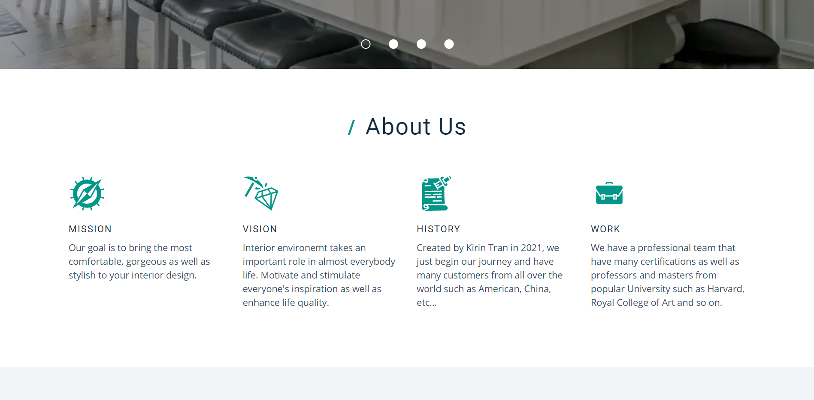
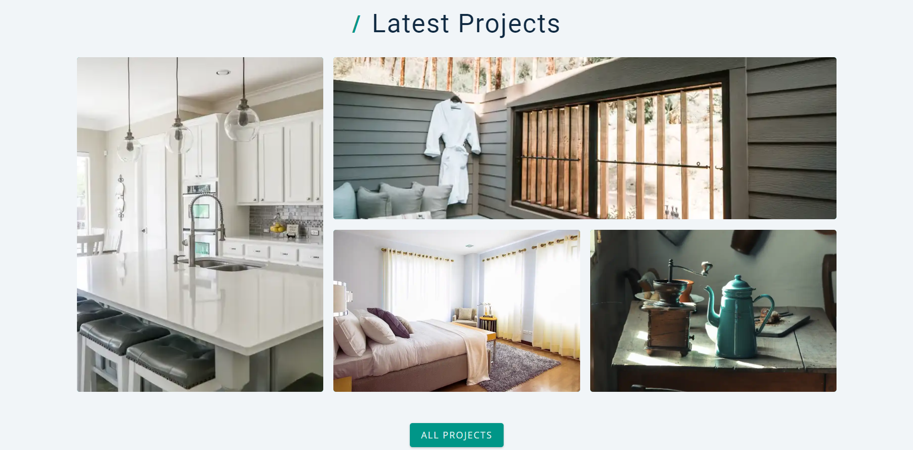
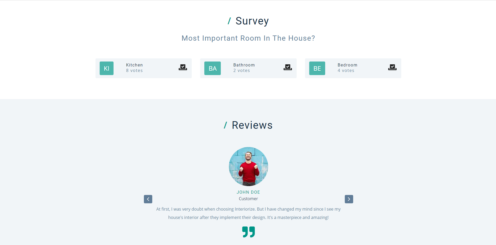
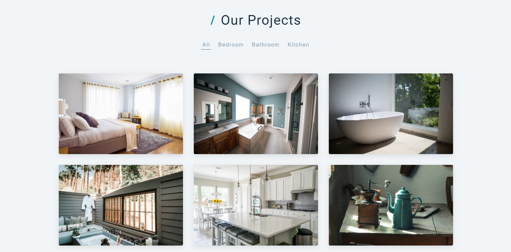
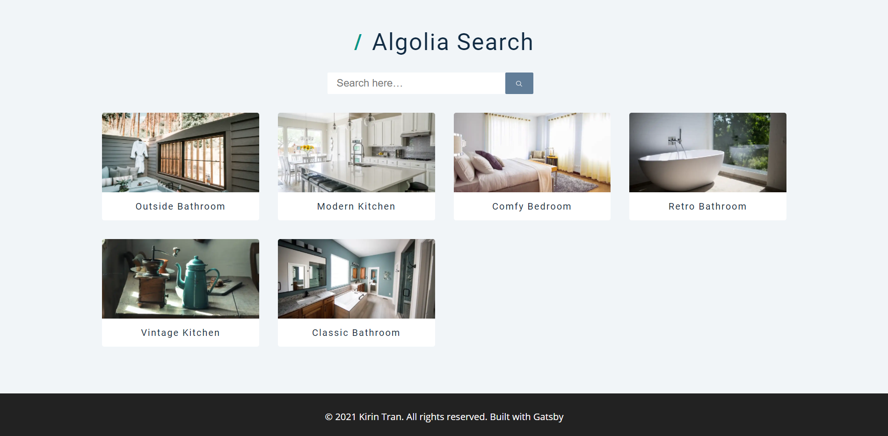

#  Interior Design

## [Try it here](https://interiorize.netlify.app)

## What is Interiorize?
- A landing page for interior design.
- This is a static website so it's quite fast.
- Hope you enjoy and have fun!
**Note:** If the search service doesn't work, it maybe out of free trial.

## Technology
- Frontend
  - React - A JavaScript library for building user interfaces
  - Gatsby - The static dynamic site generator
  - Gatsby's hello-world starter - Gatsby boilerplate
- Backend
  - Airtable - Headless CMD
  - Algolia - Search Serivce

## Some preview images
&nbsp;
&nbsp;
&nbsp;

## Available Scripts
- At first, you need to create `.env.development` for local and `.env.production` for production with the content of `.env.example` replaced with suitable values.

## Run in development
```
yarn start
```

## Format project
```
yarn format
```

## Build project
```
yarn build
```
# License & copyright

© Kirin Tran, FPT University TP.HCM
Licensed under the [MIT LICENSE](LICENSE).